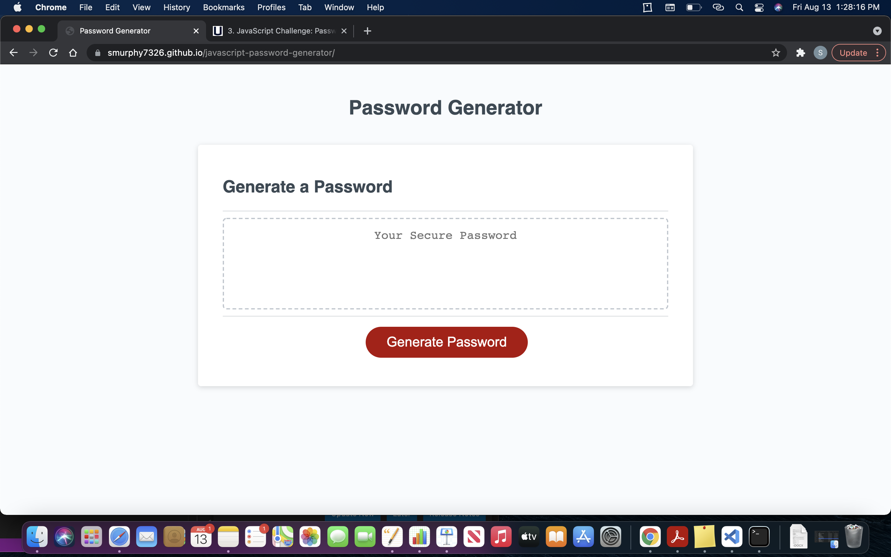
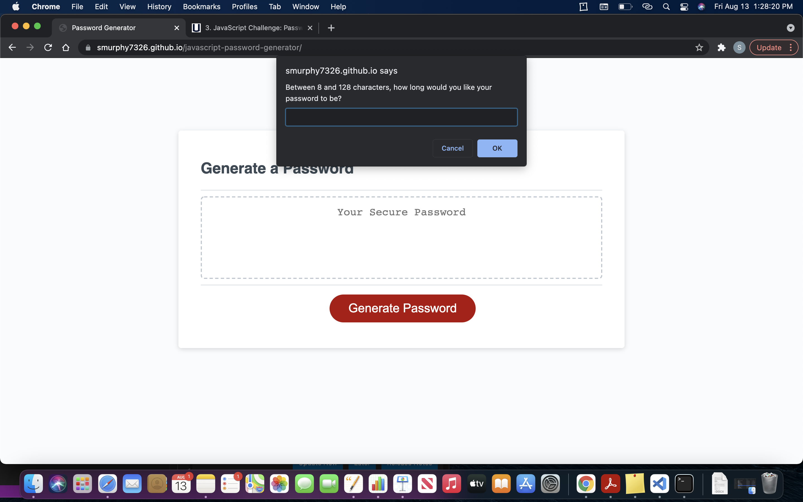
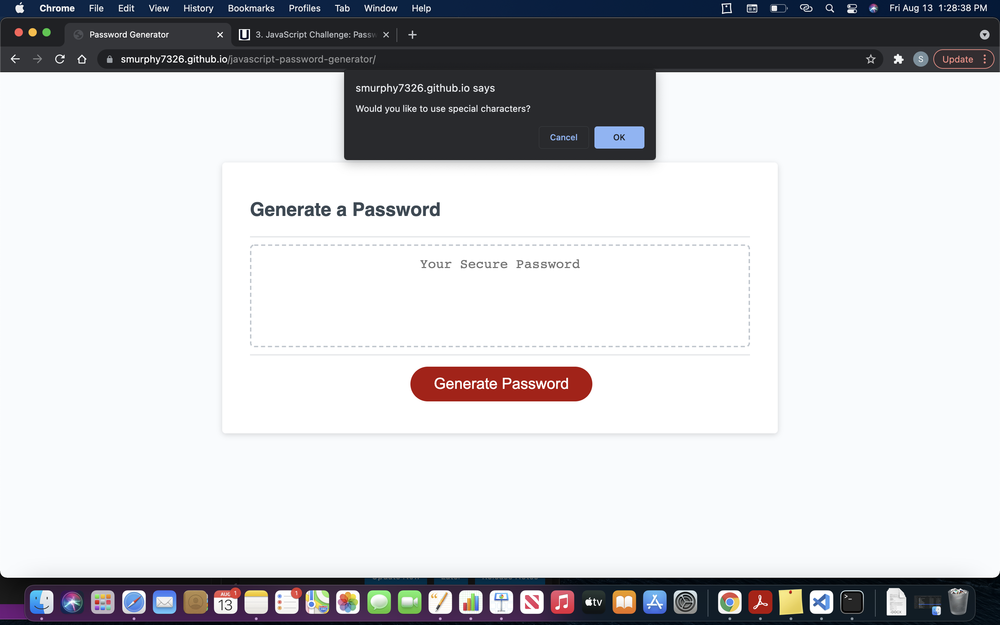

# javascript-password-generator

## Purpose

### Version 1 - First Commit

### Version 1.1 - Folders Working
* Made sure the folders were working and located in the repositiory

### Version 1.2 - Password Length
* Making sure of the length of the password is between 8 and 128 characters

### Version 1.3 - Updated README
* Started to work on the README.md file

### Version 1.4 - Lowercase Prompt
* Worked on the lowercaser prompt to be asked when they insert a character length in the password genereator

### Version 1.5 - Upper and Special
* Added Uppercase characters to Javascript for the prompts after the lowercase prompt is asked
* Added numbers to Javascript for the prompts after the lowercase prompt is asked
* Added special characters to Javascript for the prompts after the lowercase prompt is asked

### Version 1.6 - prompts
* Worked on the prompts for if nothing was chosen for variables
* Added a for loop

### Version 1.7 - Fixed up top so all prompts work
* Adjusted the let allChar so there was a space between so more prompts could be shown

### Version 1.8 - Updated README.md
* Updated the README.md
* Added images to a CSS folder in the repository

### Version 1.9 - Assets Folder
* Added an assets folder into the develop folder
* Added images for the README.md to the assets folder

### Version 1.10 - Images Folder
* Added the pictures to the images folder
* Images Folder was under the assets folder

### Version 1.11 - Updated README
* Added the image links to README
* Added link to wokring website in README

### Version 1.12 - Updated Pictures and link
* Took away spaces from the images to make them work
* Took away the spaces from the link to make that work
* Updated README.md

[Password-Generator](https://smurphy7326.github.io/javascript-password-generator/)